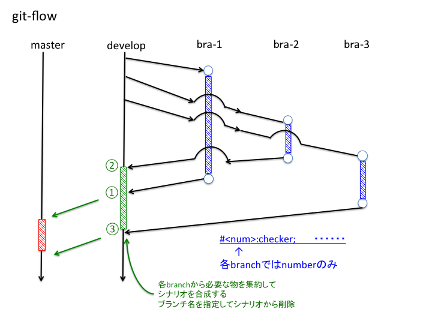

#  git-flow like な開発環境におけるDatabase構造の継続的管理手法の提案

## はじめに

近年，ソフトウェア開発の現場ではSubversion, Git等のバージョン管理システム（Version Control System = VCS）を使用することが一般的となっている．VCSを使用する事で，複数の開発者がソースコードの一貫性を保って品質の高いソフトウェアの開発を行う事が可能となるからである．特に分散VCSであるGitに於いては，開発者が地理的・時間的に分散し，同じソフトウェアに対して異なった修正を行っていたとしても，安全かつ効率良く開発を行う事の出来る手法としてgit-flowが提唱されている．

業務系ソフトウェアの開発現場においても，VCSの利用は普及している[[1]]( http://bit.ly/1WubPNW )．これに対して（マスタデータを含む）Database構造（スキマ+マスタデータ）を維持・管理する方式については，「DB構造定義書」やスキマ変更SQLを手作業で管理（せいぜいVCSに投入して世代管理）している現場が多いと思われる．

業務系など更新頻度の比較的低いソフトウェアの場合，ソフトウェアの更新が完了した時点でのDatabase構造と既存のものを比較し，データ移行を実施することで対応する事が多い．しかし，Consumer向けサービスなどの，更新頻度が高くかつデータ移行に多大なコスト（費用+時間）を掛けられないソフトウェアでは，ソフトウェア更新時に短時間でDB構造やマスタデータを変更したり，作業が手作業にならざるを得ないなどの理由で，更新ミスが発生して，サービスの停止にまで至る事態がしばしば発生する．

ソースコード管理についてはgit-flow[[2]]( http://danielkummer.github.io/git-flow-cheatsheet/index.ja_JP.html )など，継続的開発と運用（いわゆるdevops）を実施する手法が提案されているが，Database構造の一貫性維持と，開発環境から本番環境へのリリース作業については，決定的な手法はまだ確立されていない．

本稿ではgit-flow 風な手法で開発・リリースを行い，サービスを停止せず（あるいは短時間の停止で）継続的に更新をおこなうシステムにおいて，開発環境（開発者ごとの個別環境，テスト環境およびステージング環境）と本番環境のDatabase構造の一貫性を保ったまま継続的な更新を行う手法について提案する．

## 集中型開発時におけるDatabase管理手法

開発者がひとりの場合，あるいは複数人での開発であっても地理的・時間的に集中した開発手法の場合，単純なシナリオ方式での構成管理で事足りる．この場合，シナリオ番号を序数かつユニークに設定する事Database構造の一貫性は保証される．

### 集中型開発時のシナリオ書式

```
#number:checker:KIND:files:workdir
```

| 項目 | 意味 |
|-----|---------------------|
|number| シナリオ番号（連番） |
|checker|シナリオ実行可否をチェックするシェルスクリプト．戻り値が1の場合のみ実行．|
|KIND|シナリオ種別．SQL, TARBALL, SCRIPTなど|
|files | シナリオが実行するSQL等のファイル |
|workdir| シナリオを実行する際のディレクトリ |


### シナリオの実装

本ツールの初版はシェルスクリプトで実装されているため，シナリオファイル自体をシェルスクリプトとして定義することで，各種環境変数を簡易に設定する事ができる．この時，シナリオ自身が実行時エラーをおこさないように，シナリオ行頭は#ではじめる．シナリオ自身のコメントは##で行開始をする．

## 分散型開発時におけるDatabase管理手法

Git を用いて分散型開発を行っている場合，複数の開発単位が同時並行で進行することはよくある．この時ソースコードの一貫性を担保するためにgit-flowの手法を用いることも多い．



git-flowの手法では通常，開発単位毎にbranchが切られる．そしてこられの修正ごとに，Database構造が変更される事がありうる．この時悩ましいことに，これらの開発単位が必ずしもbranchが切られた順あるいはbranch名の並びなどでリリースされるわけではない．またDatabase構成の変更シナリオは地理的・時間的に分散した開発者毎に作成されるため，シナリオの一貫性を保つことが大変難しい．

そこでgit-flow風手順による分散開発環境において，継続的にDatabase構造の一貫性を保持する為の手法を開発した．

### 分散型開発時のシナリオ書式

本手法では，シナリオをbranch毎に特定のディレクトリ下のbranch名で作成したディレクトリ下に配置する．例えば


本手法ではシナリオの書式を以下の通りとする．

```
#@branch-<num>:checker:KIND:files:workdi
```

集中型開発時のシナリオとの相違は「シナリオid」のみである．
 
 各ブランチでのシナリオルール
a)db_updates/<branch名>に配置
b)シナリオ番号は連番数値で

develop, releaseへのマージ（マージツールを作成する）
a)シナリオ番号は@branch名-<num>
b)追加マージ可能とする
c)branch単位で削除可能とする
